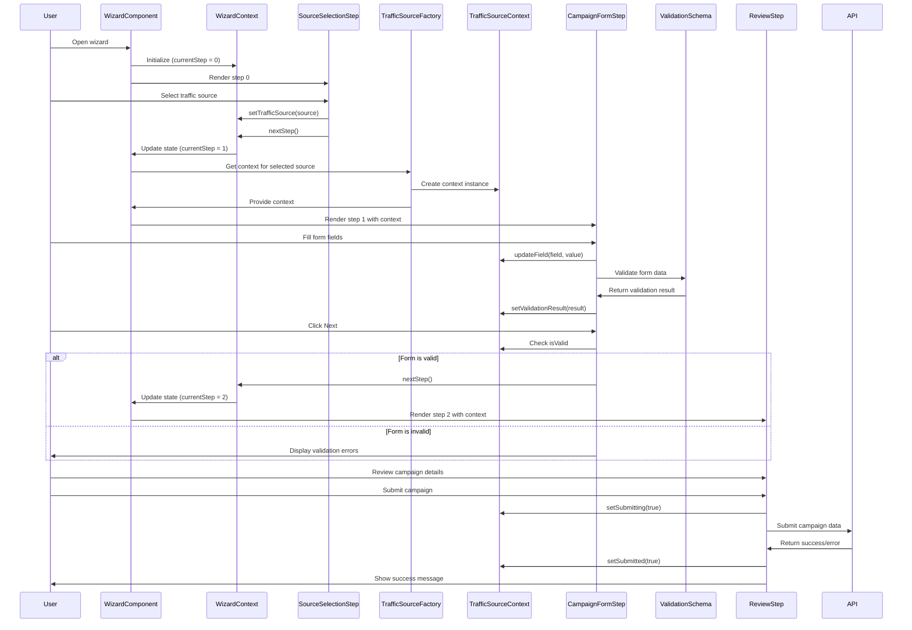

# Ad Campaign Wizard

https://grinsteindavid.github.io/mvp-wizard-campaign-creation/

A React-based wizard for creating ad campaigns across multiple traffic sources like Google Ads, RevContent, and Yahoo Gemini. This project provides a step-by-step interface for configuring and validating ad campaigns with different requirements based on the selected traffic source.

## Architecture Overview

The application follows a modular architecture with clear separation of concerns:

1. **Wizard Component**: Provides the step-by-step interface and navigation
2. **Context System**: Manages state across components
   - WizardContext: Handles navigation and step progression
   - Traffic Source Contexts: Handle source-specific data and validation
3. **Schema System**: Defines validation rules for each traffic source
4. **Form Components**: Reusable UI components for building forms
5. **Services**: Utilities for validation and API integration

### Wizard Flow Sequence Diagram

The following sequence diagram illustrates the flow of the wizard and the interactions between components:



This diagram shows the key interactions between the user, the wizard components, and the various contexts during the campaign creation process.

## Project Structure

```
src/
├── components/
│   ├── FormComponents/     # Generic reusable form components
│   │   ├── fields/         # Specialized field components (TextField, SelectField, etc.)
│   │   ├── styled/         # Styled components for form elements
│   │   ├── FormField.js    # Field wrapper component
│   │   ├── FormGroup.js    # Component for grouped fields
│   │   ├── ArrayField.js   # Component for array fields
│   │   └── DynamicForm.js  # Dynamic form generator
│   └── Wizard/             # Wizard components
│       ├── Steps/          # Step components
│       │   ├── SourceSelectionStep.js  # Traffic source selection
│       │   ├── CampaignFormStep.js     # Campaign configuration
│       │   └── ReviewStep.js           # Review and submit
│       ├── styled/         # Styled components for wizard UI
│       ├── constants.js    # Wizard configuration constants
│       └── WizardComponent.js  # Main wizard component
├── contexts/
│   ├── WizardContext.js           # Navigation state management
│   ├── BaseTrafficSourceContext.js # Base context for traffic sources
│   ├── GoogleTrafficSourceContext.js
│   ├── YahooTrafficSourceContext.js
│   ├── RevContentTrafficSourceContext.js
│   └── TrafficSourceFactory.js    # Factory for traffic source contexts
├── schemas/
│   ├── baseSchema.js       # Common validation rules
│   ├── googleSchema.js     # Google-specific validation
│   ├── yahooSchema.js      # Yahoo-specific validation
│   ├── revContentSchema.js # RevContent-specific validation
│   └── index.js            # Schema exports and utilities
├── services/
│   └── validationService.js # Joi validation service
└── utils/
    └── validationUtils.js   # Validation helper functions
```

## Features

- Multi-step wizard interface with progress tracking
- Dynamic form generation based on traffic source
- Different form field types (text, select, checkbox, arrays, etc.)
- Form validation using Joi
- Context-based state management with separation of concerns
- Responsive design with styled-components
- Comprehensive test coverage

## Component Systems

### Wizard Component

The Wizard component provides a step-by-step interface for creating ad campaigns across different traffic sources.

#### Architecture

- **WizardComponent**: Orchestrates the wizard flow and step rendering
- **Step Components**: Individual components for each step of the wizard
  - SourceSelectionStep: Allows selecting a traffic source
  - CampaignFormStep: Displays a form with fields specific to the selected source
  - ReviewStep: Shows a summary of the campaign details before submission
- **Navigation**: Managed through the WizardContext

#### Flow Logic

1. **Step Navigation**: The wizard tracks the current step and provides navigation controls
2. **Traffic Source Selection**: When a source is selected, the appropriate context is provided
3. **Form Validation**: Each step validates its data before allowing progression
4. **Submission**: The final step allows reviewing and submitting the campaign

### Context System

The application uses React Context for state management with a clear separation of concerns.

#### WizardContext

Responsible for managing the navigation flow of the wizard interface:

- **Step Navigation**: Methods for moving between steps (`nextStep`, `prevStep`, `setStep`)
- **Traffic Source Selection**: Tracks the selected traffic source type
- **Progress Tracking**: Maintains the `lastCompletedStep` to track user progress

#### Traffic Source Contexts

Each traffic source has its own context that extends from the `BaseTrafficSourceContext`:

- **BaseTrafficSourceContext**: Provides common functionality for all sources
  - Form field state management
  - Validation state tracking
  - Submission state management
- **Source-Specific Contexts**: Extend the base with source-specific fields and validation
  - GoogleTrafficSourceContext
  - YahooTrafficSourceContext
  - RevContentTrafficSourceContext

#### TrafficSourceFactory

Dynamically provides the appropriate traffic source context based on the selected source.

### Schema System

Validation schemas built with Joi for validating form data.

#### Schema Structure

- **baseSchema**: Common validation rules used across all traffic sources
- **Traffic Source Schemas**: Extend the base schema with source-specific rules
  - googleSchema
  - yahooSchema
  - revContentSchema

#### Schema Usage

The schemas are used with the Traffic Source Contexts to validate form data before submission.

### Form Components

Reusable components for building dynamic forms.

#### Component Types

- **Field Components**: Specialized components for different input types
  - TextField, SelectField, CheckboxField, etc.
- **Container Components**: Organize and structure form fields
  - FormGroup: Groups related fields
  - ArrayField: Manages arrays of fields
  - DynamicForm: Generates forms from configuration

## Extending the Application

To add a new traffic source to the application, follow these steps:

1. **Create a Schema**
   - Create a new schema file in the `/src/schemas/` directory (e.g., `newSourceSchema.js`)
   - Extend the base schema with source-specific validation rules
   - Add the new schema to the exports in `index.js`

2. **Create a Traffic Source Context**
   - Create a new context file in the `/src/contexts/` directory (e.g., `NewSourceTrafficSourceContext.js`)
   - Use the `createTrafficSourceProvider` and `createUseTrafficSource` functions from `BaseTrafficSourceContext.js`
   - Define source-specific initial state and fields

3. **Update the Traffic Source Factory**
   - Add the new source to the `TrafficSourceFactory.js` file
   - Include the new context in the factory's switch statement

4. **Add to Source Selection**
   - Update the `SourceSelectionStep.js` component to include the new source as an option

5. **Add Tests**
   - Create test files for the new schema and context
   - Update existing tests as needed

## Available Scripts

In the project directory, you can run:

### `npm start`

Runs the app in the development mode.\
Open [http://localhost:3000](http://localhost:3000) to view it in your browser.

The page will reload when you make changes.\
You may also see any lint errors in the console.

### `npm test`

Launches the test runner in the interactive watch mode.\
See the section about [running tests](https://facebook.github.io/create-react-app/docs/running-tests) for more information.

### `npm run build`

Builds the app for production to the `build` folder.\
It correctly bundles React in production mode and optimizes the build for the best performance.

The build is minified and the filenames include the hashes.\
Your app is ready to be deployed!

See the section about [deployment](https://facebook.github.io/create-react-app/docs/deployment) for more information.

### `npm run eject`

**Note: this is a one-way operation. Once you `eject`, you can't go back!**

If you aren't satisfied with the build tool and configuration choices, you can `eject` at any time. This command will remove the single build dependency from your project.

Instead, it will copy all the configuration files and the transitive dependencies (webpack, Babel, ESLint, etc) right into your project so you have full control over them. All of the commands except `eject` will still work, but they will point to the copied scripts so you can tweak them. At this point you're on your own.

You don't have to ever use `eject`. The curated feature set is suitable for small and middle deployments, and you shouldn't feel obligated to use this feature. However we understand that this tool wouldn't be useful if you couldn't customize it when you are ready for it.

## Recent Updates

### Form Components Refactoring

- **Separated Styled Components**: Created dedicated styled component files
- **Created Specialized Field Components**: Implemented individual components for each input type
- **Simplified FormField Component**: Transformed into a thin wrapper that uses the appropriate field component
- **Added Form Utilities**: Helper functions for form handling
- **Added Documentation and Tests**: Comprehensive documentation and unit tests

### Wizard and Traffic Source Context Refactoring

- **WizardContext Refactoring**: Simplified to focus solely on navigation and steps
- **Traffic Source Context Enhancement**: Improved validation and submission functionality
- **Component Updates**: Updated components to use the refactored contexts
- **Improved Separation of Concerns**: Each context now has a single responsibility

## Component Documentation

For more detailed documentation on specific components, refer to the README files in their respective directories:

- [Wizard Components](/src/components/Wizard/README.md)
- [Context System](/src/contexts/README.md)
- [Schema System](/src/schemas/README.md)

## Development Principles

This project follows these key development principles:

1. **Separation of Concerns**: Each component and module has a single responsibility
2. **Reusability**: Components are designed to be reusable across the application
3. **Testability**: Code is structured to be easily testable
4. **Maintainability**: Clear organization and documentation for easier maintenance
5. **Scalability**: Architecture allows for adding new traffic sources and features

## Contributing

Contributions are welcome! Please feel free to submit a Pull Request.

## License

This project is licensed under the MIT License - see the LICENSE file for details.

---

# Ad Campaign Wizard
